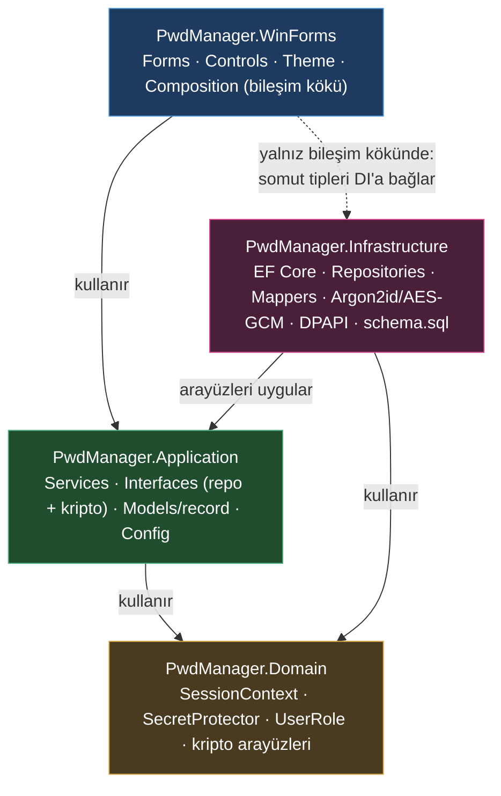
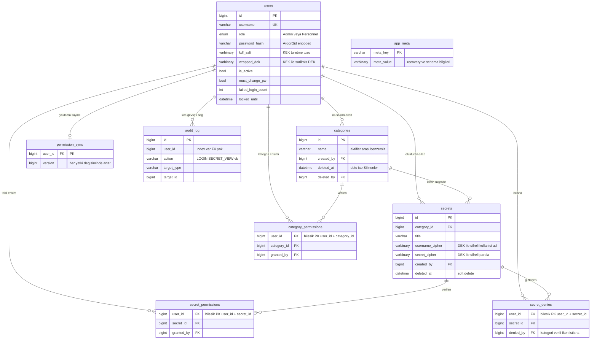
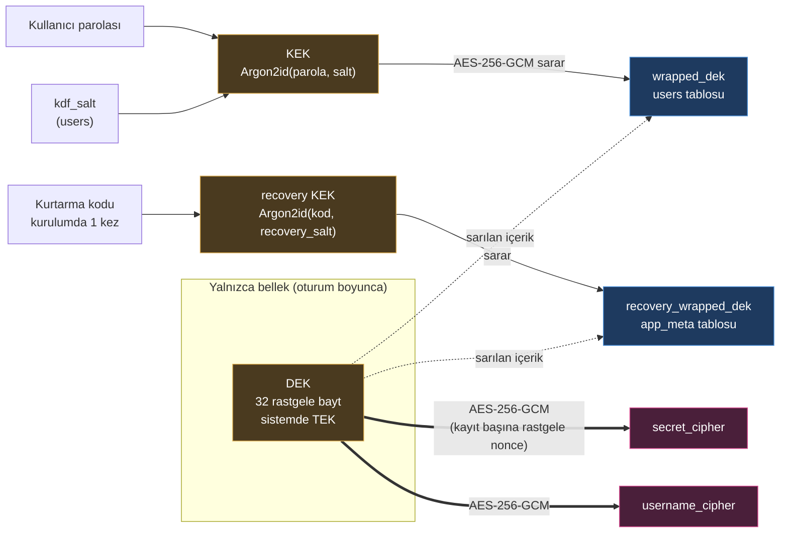
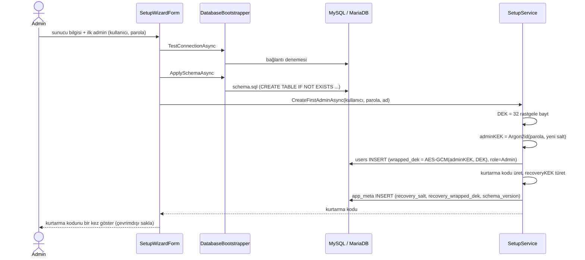
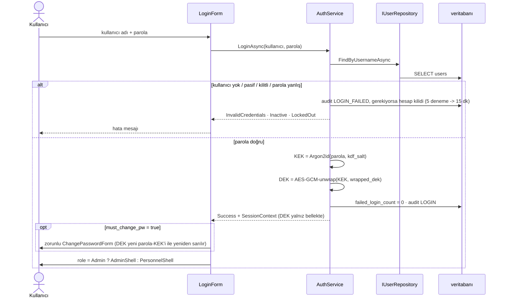
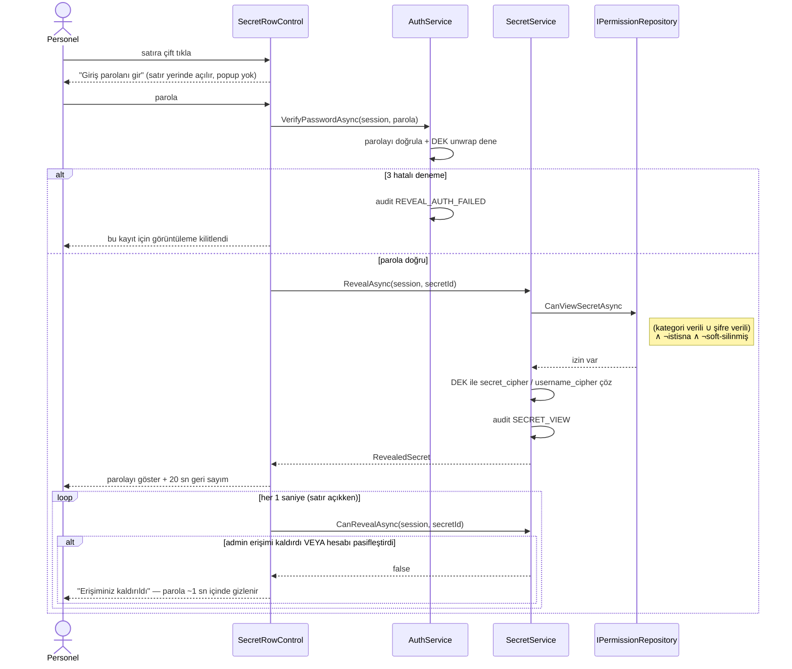
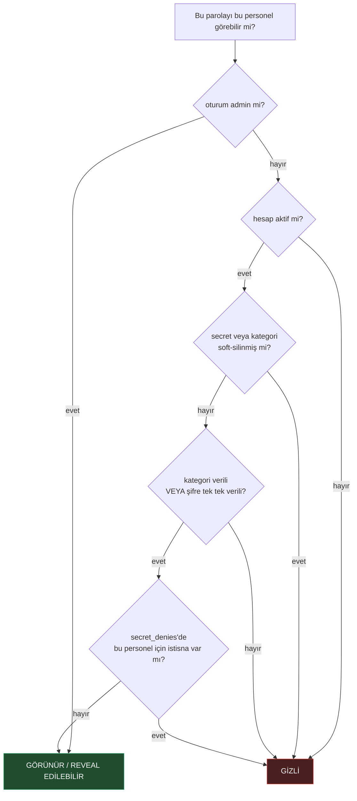
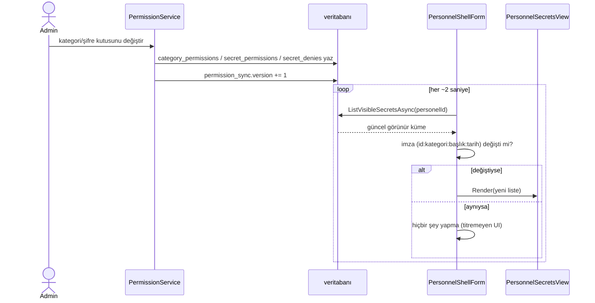

# PwdManager — Kurumsal Şifre Yönetimi

Windows masaüstü (WinForms / .NET 8), koyu tema (Guna.UI2.WinForms), **MySQL/MariaDB**.
İki rol: **Admin** ve **Personel**. Parolalar istemci tarafında **AES-256-GCM** ile
şifrelenir; veritabanına düz metin hiçbir zaman yazılmaz.

## Çözüm yapısı

Katmanlı (Clean Architecture) — bağımlılık yönü tek yönlü:
`WinForms → Application → Domain` ve `Infrastructure → Application (+ Domain)`.
**Application, Infrastructure'ı tanımaz**; **WinForms doğrudan veri katmanını bilmez**
(EF/Pomelo/DPAPI yalnızca Infrastructure ve WinForms'un bileşim kökünde adlandırılır).

| Proje | Sorumluluk |
|-------|-----------|
| `PwdManager.Domain` | Saf kurallar ve modeller: `SessionContext` / `SecretProtector` oturum bağlamı, `UserRole`, kriptografi **soyutlamaları** (`IPasswordHasher`, `IKeyDerivation`, `IDataProtector`, `IRecoveryCodeService`). DB/EF/WinForms yok. |
| `PwdManager.Application` | Use-case servisleri (`Services/` — Auth/Category/Secret/Personnel/Permission/Trash/Setup), repository **arayüzleri** (`Interfaces/Repositories.cs`), DTO/record'lar (`Models/Records.cs`), yapılandırma modeli (`Configuration/AppConfig.cs`), `AddApplication`. EF Core'a bağımlı değildir. |
| `PwdManager.Infrastructure` | **EF Core (Database First)** — `Sql/schema.sql` veritabanını tanımlar; `Entities/` + `Persistence/PwdManagerContext` bu şemadan `dotnet ef dbcontext scaffold` ile üretilir. `Repositories/` Application arayüzlerini uygular ve EF entity ↔ record eşlemesi yapar (`Mappers.cs`); `Security/` Argon2id/AES-GCM somut sınıfları; `Configuration/` DPAPI'li `ConfigStore` + `DatabaseBootstrapper`; `AddInfrastructure`. |
| `PwdManager.WinForms`  | WinForms arayüz, koyu tema yöneticisi, bileşim kökü (`Composition/` — `AppServices` katman DI uzantılarını birleştirir), kurulum sihirbazı. Formlar yalnızca Application tiplerini/record'larını görür; EF entity görmez. |

### Katman bağımlılık diyagramı



Ok tek yönlüdür. **Application, Infrastructure'ı bilmez** (EF/Pomelo/DPAPI oraya sızmaz);
**Domain hiçbir katmana bağımlı değildir**. WinForms'un Infrastructure'a tek dokunuşu
`Composition/`'da somut sınıfları DI kabına kaydetmesidir.

### Veri katmanı — Database First akışı

1. `Sql/schema.sql` tek doğ­ru kaynaktır; şema değişince önce burası güncellenir ve MariaDB'ye uygulanır.
2. Entity/DbContext yeniden üretimi (`src/PwdManager.Infrastructure` dizininden):

   ```bash
   dotnet ef dbcontext scaffold "Server=127.0.0.1;Port=3306;Database=pwdmanager;User Id=root;Password=" \
     Pomelo.EntityFrameworkCore.MySql --context PwdManagerContext \
     --context-dir Persistence --output-dir Entities \
     --namespace PwdManager.Infrastructure.Entities --context-namespace PwdManager.Infrastructure.Persistence \
     --no-onconfiguring --force
   ```

3. Not: scaffold `app_meta` tablosunu `AppMetum` olarak adlandırır; bu ad `AppMetaRepository` içinde kapsüllenmiştir, dışarı sızmaz.
4. `is_active` / `must_change_pw` sütunları DB varsayılanı taşıdığı için `bool?` olarak üretilir; repository katmanı bunu net şekilde ele alır.

## Veritabanı şeması (ER)

`schema.sql` — 9 tablo, InnoDB, `utf8mb4`. Şifreli alanlar `VARBINARY` (nonce‖ciphertext‖tag).



- **Soft delete:** `categories.deleted_at` / `secrets.deleted_at`. Etkin görünürlük =
  `secrets.deleted_at IS NULL AND categories.deleted_at IS NULL`.
- **Cascade:** kategori kalıcı silinince altındaki `secrets` + tüm `*_permissions` / `secret_denies` de silinir.
- **`audit_log.user_id`** FK değil (kullanıcı silinse bile denetim kaydı kalsın diye) — yalnız index.

## Şifreleme mimarisi (zarf şifreleme)

```
DEK  (Data Encryption Key)  = 32 rastgele bayt. Sistemde TEK. Sadece bellekte açık durur.
KEK  (Key Encryption Key)   = Argon2id(kullanıcı_parolası, kdf_salt)  — her kullanıcı için ayrı
wrapped_dek                 = AES-256-GCM(KEK, DEK)  — users tablosunda saklanır

Parola kaydı:
  secret_cipher   = AES-256-GCM(DEK, parola)        (kayıt başına rastgele 12 baytlık nonce)
  username_cipher = AES-256-GCM(DEK, kullanıcı_adı)

Giriş:  parola -> KEK -> wrapped_dek çözülür -> DEK belleğe alınır (oturum boyunca)
Personel görüntüleme:  çift tıkla -> parolayı tekrar iste -> KEK -> DEK -> izni DB'den
                       yeniden doğrula -> secret_cipher çöz -> 20 sn göster -> maskele
```

### Anahtar hiyerarşisi



Kesikli oklar "bu anahtar şununla sarılıp saklanır" demektir; DEK diske hiçbir zaman
açık yazılmaz. `wrapped_dek` **her kullanıcı için ayrı** (admin kişiyi eklerken kendi
DEK'ini yeni kullanıcının parola‑KEK'i ile yeniden sarar) — böylece herkes aynı DEK'i
açar ama admin kimsenin parolasını görmez.

Veritabanını ele geçiren ancak kullanıcı parolalarını bilmeyen biri yalnızca
rastgele bloblar ve Argon2id özetleri görür — hiçbir parolayı çözemez.

**Kurtarma anahtarı:** Kurulumda bir kez üretilir ve gösterilir. DEK'in parola
bağımsız bir kopyasını sarar; tüm admin parolaları kaybolursa sistemi kurtarır.
Çevrimdışı (kağıt/kasa) saklanmalıdır.

## Roller

### Admin
- Parola ve kategori üzerinde tam CRUD. **Silme = soft delete**: kayıt DB'de kalır,
  arayüzden gizlenir; admin **Silinenler** sekmesinden geri yükleyebilir veya kalıcı
  silebilir. Etkin görünürlük = `secrets.deleted_at IS NULL AND categories.deleted_at IS NULL`;
  soft-silinen bir şey personele görünmez ve reveal edilemez (`ListVisibleSecrets` +
  `CanViewSecret` filtreli). Personel bu sekmeyi hiç görmez.
- Personel hesabı oluşturma, parola sıfırlama, **Aktif/Pasif**: pasifleştirilen personelin
  açık oturumu ~2 sn içinde kapanır (giriş ekranına "Hesabınız devre dışı bırakıldı" ile döner)
  ve yeni giriş yapamaz
- Yetkilendirme: kategori bazında **veya** kategori içinde tek tek parola bazında.
  Verili bir kategoride bir şifrenin kutusu kaldırılırsa **istisna (deny)** oluşur —
  kategori verili kalır ama o şifre o personelden gizlenir. Kategoriyi yeniden vermek
  istisnaları temizler. Etkin erişim = *(kategori verili ∪ şifre verili) ∧ ¬istisna*.
- Yetki/şifre/kategori değişiklikleri personelin listesine ~2 sn içinde yansır

### Personel
- Salt okunur. Yalnızca yetkilendirildiği parolaları, kategoriye göre gruplanmış tabloda görür
- Bir kategoride hiçbir şeye erişemiyorsa o kategori listede hiç görünmez
- Şifreyi görmek için satıra çift tıklar → satır yerinde açılır, giriş parolasını orada girer (3 hakkı vardır; aşınca o kayıt kilitlenir)
- Liste her ~2 sn'de bir yoklanır; **görünen küme değişmediyse arayüz yeniden çizilmez** (imza karşılaştırması), yalnızca gerçek değişimde render edilir
- Hesap pasifleştirilmişse yoklama bunu görür ve oturumu kapatır
- **Açık satır** her saniye izni + hesap durumunu yeniden sorgular: admin eş zamanlı olarak
  erişimi kaldırır **veya** personeli pasifleştirirse parola ~1 sn içinde gizlenir
- Başarısız yeniden-doğrulama denemeleri `audit_log`'a `REVEAL_AUTH_FAILED` olarak yazılır

**Personel hesapları yalnızca admin tarafından açılır** ([PersonnelService](src/PwdManager.Application/Services/PersonnelService.cs) → `SessionContext.EnsureAdmin()`). Kendi kendine kayıt ekranı yoktur; giriş ekranı sadece kimlik doğrular.

## Akış diyagramları

### 1) İlk kurulum (setup sihirbazı)



### 2) Giriş ve oturum açılışı



### 3) Personel — parolayı görme (reveal) ve canlı iptal



### 4) Etkin görünürlük / yetki kararı

Hem `ListVisibleSecrets` (liste) hem `CanViewSecret` (reveal öncesi ve her saniye) bu mantığı uygular:



### 5) Canlı yansıma (yetki değişince personel ekranı)



## Arayüz

> **Her form ve UserControl iki dosyalıdır:** `X.Designer.cs` (yerleşim — Visual Studio
> tasarımcısında açılır ve sürükle-bırak ile düzenlenir; her sınıfın tasarımcı için
> parametresiz kurucusu vardır) + `X.cs` (olaylar, DI, iş mantığı). Koyu tema çalışma
> anında [`ThemeManager.Apply`](src/PwdManager.WinForms/Theme/ThemeManager.cs) ile uygulanır
> (renk paleti tek kaynak). Izgara satırları / ağaç düğümleri / satır listesi gibi
> **veriyle dolan** kısımlar kodda kalır — WinForms'ta doğru desen budur.
>
> Not: Guna.UI2 ücretsizdir ancak Visual Studio **tasarımcısı** ilk açılışta bir kez
> ücretsiz lisans anahtarı ister ([guna.io](https://guna.io)). `dotnet build` / `dotnet run`
> ve yayınlanan exe lisans gerektirmez.

- [Program.cs](src/PwdManager.WinForms/Program.cs) — iki fazlı açılış: hazır değilse [SetupWizardForm](src/PwdManager.WinForms/Forms/SetupWizardForm.cs), sonra [LoginForm](src/PwdManager.WinForms/Forms/LoginForm.cs)
- [LoginForm](src/PwdManager.WinForms/Forms/LoginForm.cs) → ilk girişte zorunlu [ChangePasswordForm](src/PwdManager.WinForms/Forms/ChangePasswordForm.cs) → role göre shell
- **Admin shell** ([AdminShellForm](src/PwdManager.WinForms/Forms/AdminShellForm.cs)) — sol menü + görünümler: [Kategoriler](src/PwdManager.WinForms/Forms/Admin/CategoriesView.cs) · [Parolalar](src/PwdManager.WinForms/Forms/Admin/SecretsView.cs) · [Personel](src/PwdManager.WinForms/Forms/Admin/PersonnelView.cs) · [Yetkiler](src/PwdManager.WinForms/Forms/Admin/PermissionsView.cs) (kategori/parola ağacı, onay kutuları anlık yazar) · [Denetim](src/PwdManager.WinForms/Forms/Admin/AuditView.cs)
- **Personel shell** ([PersonnelShellForm](src/PwdManager.WinForms/Forms/PersonnelShellForm.cs)) — salt okunur, **kategoriye göre gruplanmış tablo** ([PersonnelSecretsView](src/PwdManager.WinForms/Forms/Personnel/PersonnelSecretsView.cs)): her kategori başlığı + sütun başlığı + satırlar ([SecretRowControl](src/PwdManager.WinForms/Forms/Personnel/SecretRowControl.cs)). Erişilebilir parolası olmayan kategori hiç görünmez. Satıra çift tıkla → **satır yerinde açılır**, popup yok: giriş parolanı orada gir → şifre gösterilir → 20 sn geri sayım → maskelenir. ~2 sn'de bir yoklama, görünen küme değişince yeniden çizer.

## Güvenlik önlemleri

- Tüm sorgular EF Core parametreli — enjeksiyona kapalı
- `appsettings.local.json`: DB parolası Windows DPAPI (CurrentUser) ile şifreli, git'e girmez
- MySQL kullanıcısı en az yetkili olmalı: yalnız bu şemada `SELECT/INSERT/UPDATE/DELETE`
- MySQL sunucusu yalnız özel ağ / `bind-address` ile sınırlandırılmalı
- Başarısız girişte hesap kilidi (5 deneme → 15 dk); reveal'da 3 deneme → iptal
- Açık parola diske/log'a yazılmaz; KEK/DEK kullanımı sonrası `CryptographicOperations.ZeroMemory`
- `audit_log`: login, görüntüleme (+reddedilen), ekle/düzenle/sil, yetki ver/al kayıtları
- Boşta otomatik kilit ([ShellFormBase](src/PwdManager.WinForms/Forms/ShellFormBase.cs)): `IdleLockMinutes` (varsayılan 5) boyunca giriş yoksa shell kapanır, DEK temizlenir, giriş ekranına dönülür
- Servis katmanında `SessionContext.EnsureAdmin()` — personel oturumuyla yazma işlemi denenirse reddedilir (derinlemesine savunma)

## Geliştirme

Gereksinim: .NET 8 SDK (`global.json` 8.0.419'a sabitler) · **MySQL 8.x veya MariaDB 10.4+**
(geliştirmede XAMPP/MariaDB 10.4 kullanıldı; Pomelo sağlayıcısı ikisini de destekler).

```bash
dotnet build PwdManager.sln
dotnet run --project src/PwdManager.WinForms
```

İlk çalıştırmada kurulum sihirbazı açılır: DB bağlantısını test eder, `src/PwdManager.Infrastructure/Sql/schema.sql`
şemasını uygular, ilk admin hesabını oluşturur, DEK ve kurtarma anahtarını üretir.

## Masaüstü kısayolu ve çoklu pencere

```powershell
powershell -ExecutionPolicy Bypass -File .\publish-and-shortcut.ps1
```

`.\publish\PwdManager.WinForms.exe` (tek dosya) üretir ve masaüstüne **PwdManager.lnk** kısayolu koyar.
Kod değişince yeniden çalıştır.

Uygulama **tek örnek kilidi kullanmaz**: masaüstü kısayoluna üst üste tıklamak her seferinde
bağımsız, kendi giriş ekranına sahip yeni bir kopya açar — böylece iki (veya daha fazla)
hesabı aynı bilgisayarda aynı anda yönetebilirsin. Her kopyanın kendi oturumu ve kendi
bellek-içi DEK'i vardır. (Arayüzde ayrı bir "yeni pencere" düğmesi yok; kısayola tekrar
tıklamak yeterli.)
